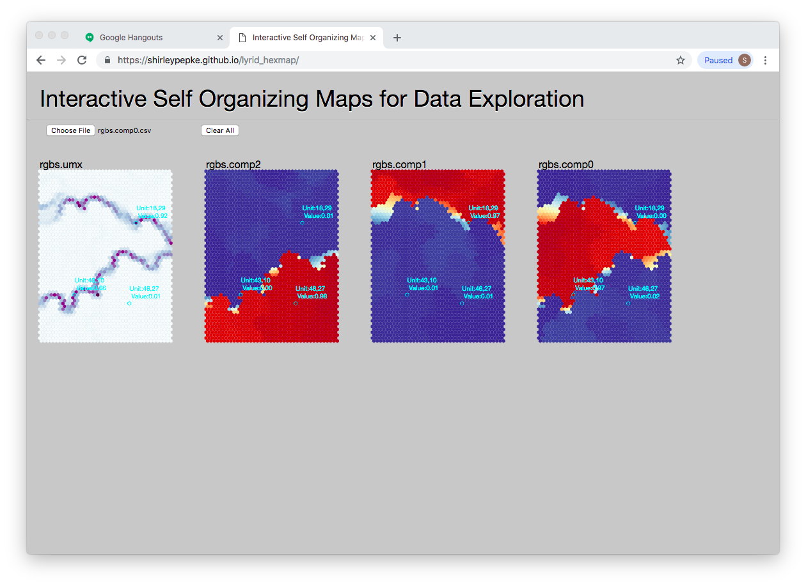

# lyrid_hexmap
Online SOM visualization and exploration using d3.js. 
Visit https://shirleypepke.github.io/lyrid_hexmap to see it in action. Sample input files can be downloaded from the data directory.

Pre and post som processing:

Before training, given a dataframe in a csv file, use csv2lrn.py to generate a .lrn format file for e.g. somoclu input.

After training, somoclu outputs .wts, .umx, and .bm files. Execute postsom.py to process these files into maps that may be displayed by lyrid_hexmap. 

Filter and map patients by label using map_patient_cats.py.
